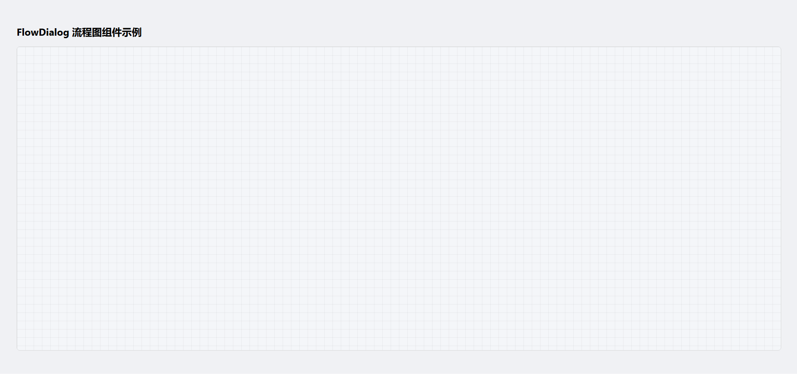

# FlowDialog 流程图组件示例项目

本项目为开源的 FlowDialog 流程图组件演示，支持节点拖拽、缩放、右键菜单、连线等功能，适用于数据流可视化场景。

## 目录结构

```
FlowDialog-demo/
├── package.json
├── README.md
└── src/
    ├── App.vue
    └── components/
        └── FlowDialog/
            ├── FlowDialog.vue
            ├── DataSourceNode.vue
            ├── MergeNode.vue
            └── utils.js
```

## 安装依赖

```bash
npm install
```

## 运行示例

```bash
npm run serve
```

## 用法说明

1. 复制 `src/components/FlowDialog` 目录到你的 Vue2 项目中。
2. 在页面中引入并注册 `FlowDialog` 组件：

```vue
<template>
  <FlowDialog />
</template>

<script>
import FlowDialog from './components/FlowDialog/FlowDialog.vue'
export default {
  components: { FlowDialog }
}
</script>
```

3. 依赖 `element-ui`，请确保已在项目中全局引入。

## 功能特性
- 支持节点拖拽、缩放、右键菜单
- 数据源节点、合并节点可视化
- 节点间可拖拽连线
- 支持流程数据导出

## License
MIT

